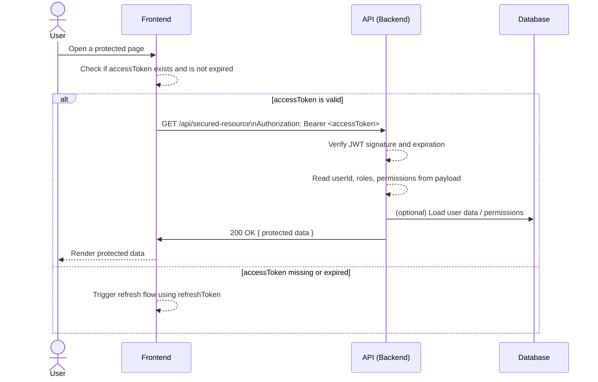

## Access auth code

```mermaid
sequenceDiagram
    actor User
    participant FE as Frontend
    participant BE as API (Backend)
    participant DB as Database

    User->>FE: Open a protected page
    FE-->>FE: Check if accessToken exists and is not expired
    alt accessToken is valid
        FE->>BE: GET /api/secured-resource\nAuthorization: Bearer <accessToken>
        BE-->>BE: Verify JWT signature and expiration
        BE-->>BE: Read userId, roles, permissions from payload
        BE->>DB: (optional) Load user data / permissions
        BE->>FE: 200 OK { protected data }
        FE-->>User: Render protected data
    else accessToken missing or expired
        FE-->>FE: Trigger refresh flow using refreshToken
    end
```