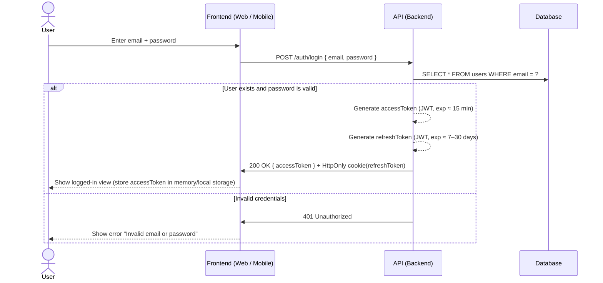

## Auth code

```mermaid
sequenceDiagram
    actor User
    participant FE as Frontend (Web / Mobile)
    participant BE as API (Backend)
    participant DB as Database

    User->>FE: Enter email + password
    FE->>BE: POST /auth/login { email, password }
    BE->>DB: SELECT * FROM users WHERE email = ?
    alt User exists and password is valid
        BE-->>BE: Generate accessToken (JWT, exp ≈ 15 min)
        BE-->>BE: Generate refreshToken (JWT, exp ≈ 7–30 days)
        BE->>FE: 200 OK { accessToken } + HttpOnly cookie(refreshToken)
        FE-->>User: Show logged-in view (store accessToken in memory/local storage)
    else Invalid credentials
        BE->>FE: 401 Unauthorized
        FE-->>User: Show error "Invalid email or password"
    end
```