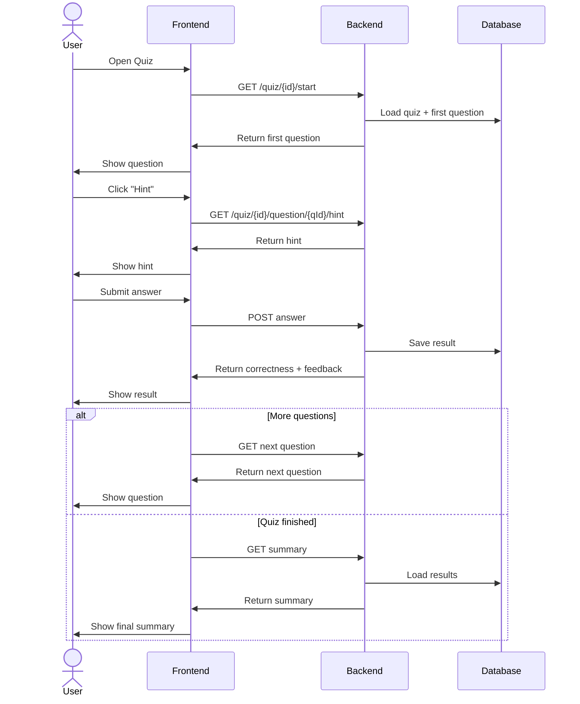

## Quizz code

```mermaid
sequenceDiagram
    actor User
    participant FE as Frontend
    participant API as Backend
    participant DB as Database

    %% ENTER QUIZ
    User->>FE: Open Quiz
    FE->>API: GET /quiz/{id}/start
    API->>DB: Load quiz + first question
    API->>FE: Return first question
    FE->>User: Show question

    %% HINT (optional)
    User->>FE: Click "Hint"
    FE->>API: GET /quiz/{id}/question/{qId}/hint
    API->>FE: Return hint
    FE->>User: Show hint

    %% SUBMIT ANSWER
    User->>FE: Submit answer
    FE->>API: POST answer
    API->>DB: Save result
    API->>FE: Return correctness + feedback
    FE->>User: Show result

    %% NEXT OR END
    alt More questions
        FE->>API: GET next question
        API->>FE: Return next question
        FE->>User: Show question
    else Quiz finished
        FE->>API: GET summary
        API->>DB: Load results
        API->>FE: Return summary
        FE->>User: Show final summary
    end
```