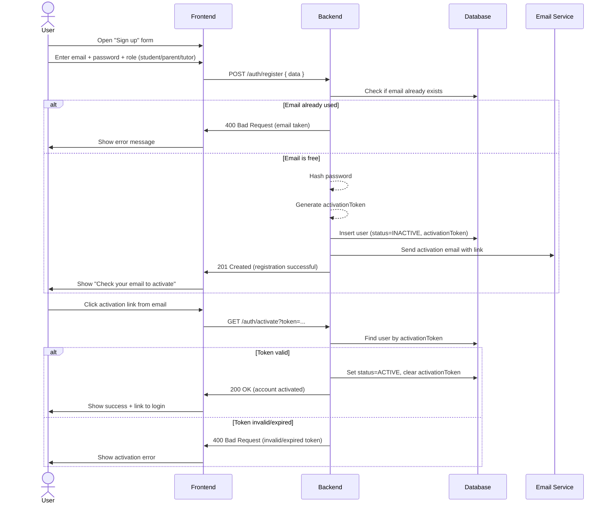

## Registration with email activation code

```mermaid
sequenceDiagram
    actor User
    participant FE as Frontend
    participant API as Backend
    participant DB as Database
    participant Mail as Email Service

    User->>FE: Open "Sign up" form
    User->>FE: Enter email + password + role (student/parent/tutor)
    FE->>API: POST /auth/register { data }

    API->>DB: Check if email already exists
    alt Email already used
        API->>FE: 400 Bad Request (email taken)
        FE->>User: Show error message
    else Email is free
        API-->>API: Hash password
        API-->>API: Generate activationToken
        API->>DB: Insert user (status=INACTIVE, activationToken)
        API->>Mail: Send activation email with link
        API->>FE: 201 Created (registration successful)
        FE->>User: Show "Check your email to activate"
    end

    User->>FE: Click activation link from email
    FE->>API: GET /auth/activate?token=...
    API->>DB: Find user by activationToken
    alt Token valid
        API->>DB: Set status=ACTIVE, clear activationToken
        API->>FE: 200 OK (account activated)
        FE->>User: Show success + link to login
    else Token invalid/expired
        API->>FE: 400 Bad Request (invalid/expired token)
        FE->>User: Show activation error
    end
```