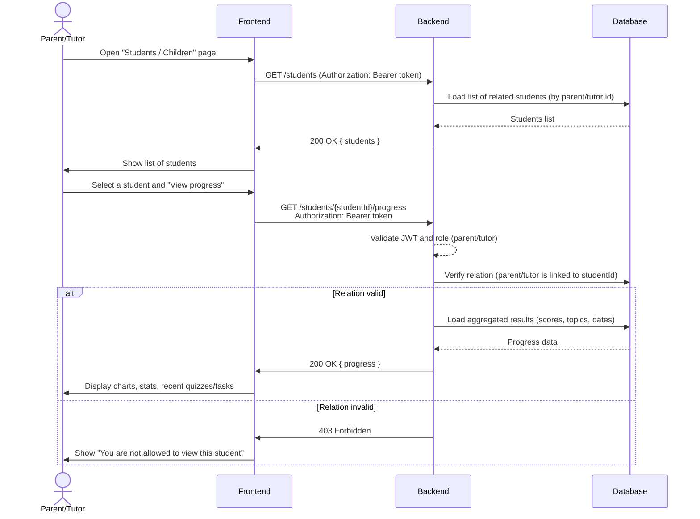

## Viewing tasks as supervisor

```mermaid
sequenceDiagram
    actor Parent as Parent/Tutor
    participant FE as Frontend
    participant API as Backend
    participant DB as Database

    Parent->>FE: Open "Students / Children" page
    FE->>API: GET /students (Authorization: Bearer token)
    API->>DB: Load list of related students (by parent/tutor id)
    DB-->>API: Students list
    API->>FE: 200 OK { students }
    FE->>Parent: Show list of students

    Parent->>FE: Select a student and "View progress"
    FE->>API: GET /students/{studentId}/progress<br/>Authorization: Bearer token

    API-->>API: Validate JWT and role (parent/tutor)
    API->>DB: Verify relation (parent/tutor is linked to studentId)
    alt Relation valid
        API->>DB: Load aggregated results (scores, topics, dates)
        DB-->>API: Progress data
        API->>FE: 200 OK { progress }
        FE->>Parent: Display charts, stats, recent quizzes/tasks
    else Relation invalid
        API->>FE: 403 Forbidden
        FE->>Parent: Show "You are not allowed to view this student"
    end
```